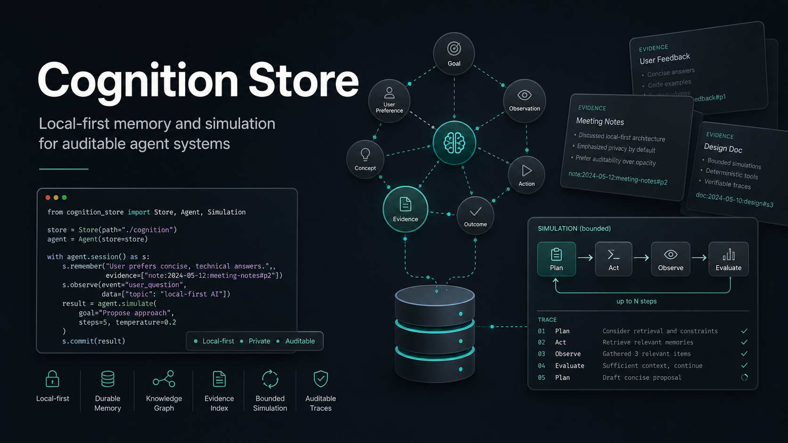

# Cognition Store



Cognition Store is a local-first evidence, graph, and simulation engine for agent systems. It turns approved local documents into evidence items, typed claims, lightweight knowledge graphs, persona panels, event logs, and machine-readable verdicts.

The project is designed for teams that need auditable decision support without sending private context to an external memory service.

## Who Needs This

- AI agent builders who need inspectable memory artifacts.
- Security and compliance teams reviewing AI-assisted recommendations.
- Consultants who need evidence-backed client reports from approved notes.
- Operators who want task completion logs, reusable lessons, and approval-aware recommendations.
- Product teams testing buyer, market, or workflow scenarios before making real-world decisions.

## Where It Can Be Used

- local developer tools and agent workbenches
- private knowledge-base systems
- compliance and audit review workflows
- sales-readiness and buyer-committee simulations
- market-risk research workflows
- defensive automation products that need human approval gates

## What It Does

- Indexes local Markdown and text files as redacted evidence.
- Extracts simple claims and links them back to source evidence.
- Builds file-based knowledge graphs for reviewable reasoning traces.
- Runs bounded simulations for buyer committees, market-risk analysis, and task-completion learning.
- Writes immutable action logs and JSON verdict reports.
- Keeps approval-sensitive actions as drafts only.

## Memory Architecture

Cognition Store models agent memory as four practical layers:

- Working memory: current run inputs, temporary evidence, and active simulation state.
- Episodic memory: timestamped action logs and completed run summaries.
- Semantic memory: evidence-backed claims and knowledge-graph relationships.
- Procedural memory: reusable lessons, guardrails, and approval-aware recommendations.

All outputs are written to local files by default.

## Guardrails

- No production, finance, contract, or external communication action is executed from simulation output.
- Local notes and generated examples should use synthetic or approved data only.
- Secret markers are detected and redacted before evidence is indexed.
- Approval-sensitive findings are written as draft artifacts for human review.
- The engine is decision support, not an autonomous authority.

## Install

```bash
python3 -m venv .venv
. .venv/bin/activate
pip install -e .
```

No third-party runtime dependency is required for the core demos.

For development and tests:

```bash
pip install -e ".[dev]"
```

## Quick Start

```bash
python3 -m cognition_store.cli agentshield-demo --output artifacts/runs
```

Runs a synthetic buyer-committee simulation.

```bash
python3 -m cognition_store.cli agentshield-buyer-sim examples/standard_b2b_sales/target-notes.md --target-name "Synthetic Target" --output artifacts/runs
```

Builds a buyer-committee map, objections, sales friction, pitch angle, first-offer structure, and review guardrails from local notes. It does not scan external systems or send outreach.

```bash
python3 -m cognition_store.cli energy-demo --output artifacts/runs
```

Runs a synthetic market-risk simulation. It does not use live market data, counterparties, contracts, finance, trading, or external communication.

```bash
python3 -m cognition_store.cli energy-ingest examples/market_compliance/market-notes.md --output artifacts/runs
```

Creates evidence, claims, a market-risk graph, actor panel, action log, deal-friction report, and verdict from approved local files.

```bash
python3 -m cognition_store.cli runtime-complete "Delivered local task. Verified smoke test passed." --project local-runtime --output artifacts/runs
```

Captures a completed task summary into evidence, claims, lessons, approval drafts, a knowledge graph, an immutable action log, and a verdict.

## Output Structure

Each run writes artifacts under `artifacts/runs/<run-id>/`:

- `manifest.json`: run metadata and guardrails
- `evidence_index.json`: redacted source evidence
- `claims.json`: extracted claims
- `knowledge_graph.json`: entities, relationships, and evidence links
- `actions.jsonl`: immutable simulation or lesson-capture events
- `verdict.json`: decision-support result and risk notes
- `summary.json`: concise run summary

See [docs/examples-gallery.md](docs/examples-gallery.md) for a fuller walkthrough of the demo outputs.

## Product Positioning

Cognition Store is not a chatbot and not an autonomous executor. It is infrastructure for agent systems that need a local reasoning record: evidence in, claims and graphs in the middle, reviewable verdicts out.

For commercial or internal adoption notes, see [docs/product-positioning.md](docs/product-positioning.md).

For planned upgrades, see [ROADMAP.md](ROADMAP.md).

## Development

```bash
python3 scripts/smoke_test.py
python3 -m compileall cognition_store scripts
```

```bash
pytest
```

GitHub Actions runs the same smoke, compile, and pytest checks on pushes and pull requests.

## License

Apache-2.0. See `LICENSE`.
